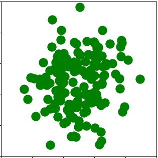
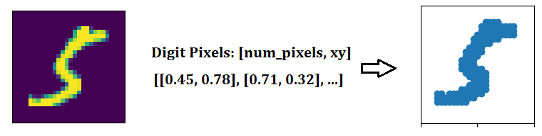
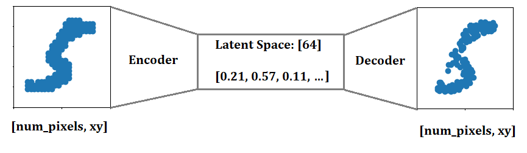

In today's post we will be looking at a couple of ways you can train a self-supervised model to handle variable lists of elements, using vanilla and variational autoencoders.

Why should I care about sets?
======
Well it turns out you probably already do care about sets. If you've ever calculated an average of an array, or pulled members of a population out that match some definition, you've already been solving set problems. These problems are incredibly common, we are just used to dealing with special cases of them.

What even is a set?
======
Sets have two main properties that define them. The first property of a set is that it is permutation-invariant, aka the elements have no order. This doesn't mean that there isn't a structure to the elements, it's just that this structure is not defined explicitly by the data type. The structure is instead a function of all of the elements. The second property is that a set does not have a fixed size. These two properties pose some interesting challenges for modelling sets both in terms of classification and generation.

An example problem
======
*The experiments in this post are based upon two papers:*  
https://arxiv.org/abs/2006.16841v2 - Adam R Kosiorek, Hyunjik Kim, Danilo J Rezende  
https://arxiv.org/abs/1810.00825 - Juho Lee, Yoonho Lee, Jungtaek Kim, Adam R. Kosiorek, Seungjin Choi, Yee Whye Teh

We'll be looking at the MNIST dataset, but in a slightly different format than what you are probably used to. Instead of treating samples as images, we will be collecting the digit pixels into a set of pixel locations. This gives us a set of coordinates that define the digits. Our goal is to compress these coordinates into a fixed size vector, then see if we can rebuild the original digit.

The Autoencoder Framework
======
An autoencoder is a self-supervised framework that uses reconstruction as it's training method. Autoencoders are composed of two models, an encoder and a decoder. The role of the encoder is to model the input information into a vector that contains useful information about the input. The decoder then has to rebuild the original input as closely as it can, using just the encoders output vector. In this case, the autoencoder can be viewed as an information compressor.
This is an interesting challenge for sets, as the set size is not constant, yet we are squeezing the set into a fixed sized vector. The decoder also needs to produce a variable sized output, given a fixed sized input.

